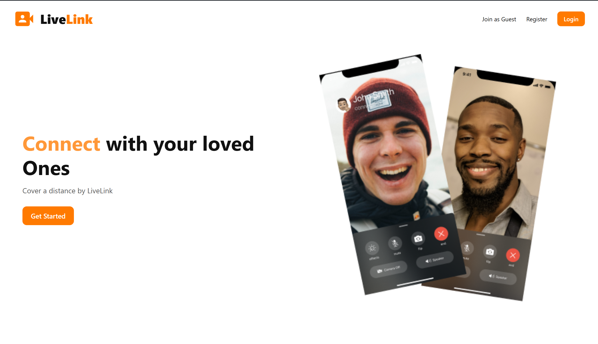
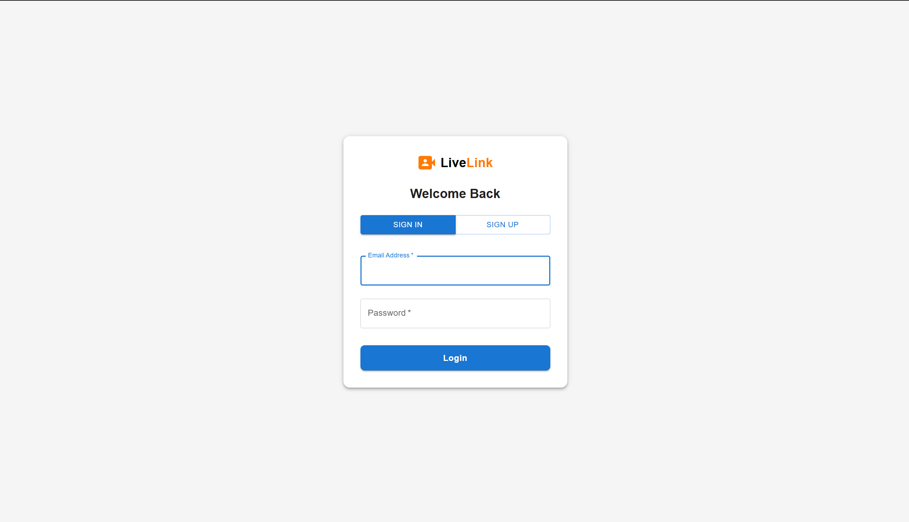
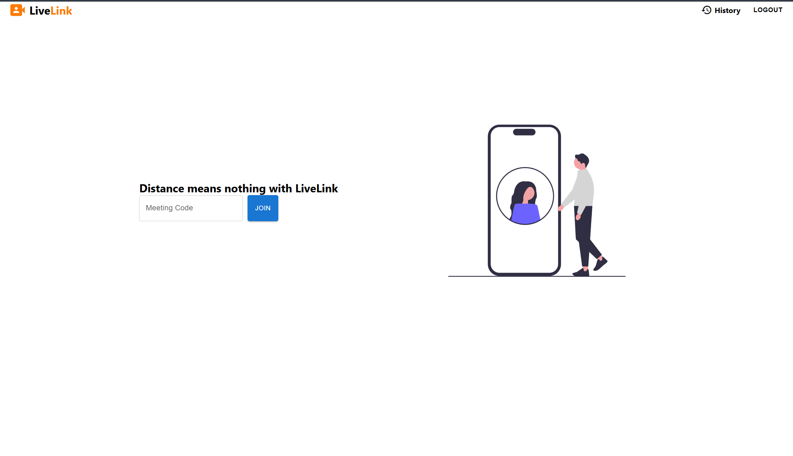
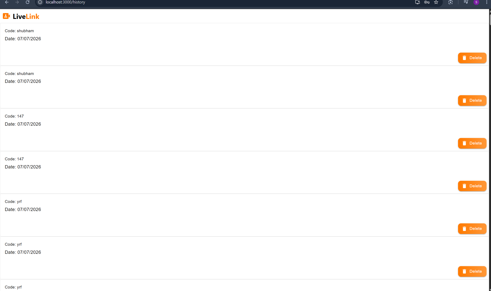
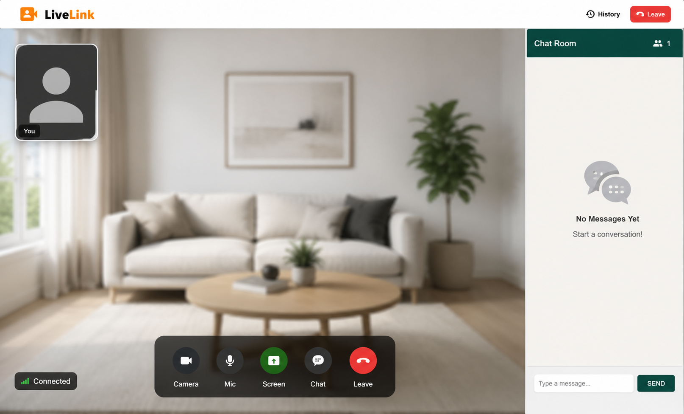

# 🎥 LiveLink

A modern real-time video conferencing web application built using the **MERN Stack**, **WebRTC**, and **Socket.IO**. LiveLink enables users to create secure video meetings, chat in real time, share screens, and manage meeting history with a simple and responsive interface.

---

## 📌 Features

- 🔐 User Authentication (Login & Register)
- 🎥 Real-Time Video Calling
- 🎤 Mute / Unmute Microphone
- 📷 Camera On / Off
- 🖥️ Screen Sharing
- 💬 Live Chat
- 📜 Meeting History
- 🔗 Join Meeting using Meeting Code
- 📱 Responsive User Interface
- ⚡ WebRTC Peer-to-Peer Communication
- 🌐 Socket.IO Real-Time Signaling

---

## 🛠️ Tech Stack

### Frontend
- React.js
- Material UI
- React Router DOM
- Axios
- CSS3

### Backend
- Node.js
- Express.js
- Socket.IO

### Database
- MongoDB
- Mongoose

### Authentication
- JWT (JSON Web Token)

### Real-Time Communication
- WebRTC
- Socket.IO

---

# 📸 Screenshots

## 🏠 Landing Page



---

## 🔐 Authentication



---

## 🏡 Home Dashboard



---

## 📜 Meeting History



---

## 🎥 Video Conference



---

# 📂 Folder Structure

```text
LiveLink
│
├── backend
│   ├── controllers
│   ├── middleware
│   ├── models
│   ├── routes
│   ├── socketManager.js
│   └── server.js
│
├── frontend
│   ├── public
│   ├── src
│   │   ├── components
│   │   ├── contexts
│   │   ├── pages
│   │   ├── styles
│   │   ├── utils
│   │   └── App.js
│   └── package.json
│
├── screenshots
│   ├── landing.png
│   ├── auth.png
│   ├── home.png
│   ├── history.png
│   └── videocall.png
│
└── README.md
```

---

# 🚀 Getting Started

## Clone the Repository

```bash
git clone https://github.com/Shubham-07-creator/LiveLink.git
```

---

## Install Frontend

```bash
cd frontend
npm install
npm start
```

Runs on:

```
http://localhost:3000
```

---

## Install Backend

```bash
cd backend
npm install
npm start
```

Runs on:

```
http://localhost:8000
```

---

# 🔑 Environment Variables

Create a `.env` file inside the **backend** folder.

```env
PORT=8000

MONGO_URI=your_mongodb_connection_string

JWT_SECRET=your_secret_key
```

---

# 🚀 Future Improvements

- 🎙️ Active Speaker Detection
- 👥 Waiting Room
- 📹 Meeting Recording
- 📁 File Sharing
- 😀 Emoji Reactions
- 🔒 Password Protected Meetings
- 🌙 Dark Mode
- 📅 Meeting Scheduling
- 📊 Meeting Analytics
- 🔔 Notifications

---

# 👨‍💻 Author

**Shubham Kumar**

**MERN Stack Developer**

📧 Email: **shubhamkumar979883@gmail.com**

💼 LinkedIn:  
https://www.linkedin.com/in/shubhamkumardev

💻 GitHub:  
https://github.com/Shubham-07-creator

---

# 🤝 Contributing

Contributions are welcome!

1. Fork the repository.
2. Create a new branch.
3. Commit your changes.
4. Push your branch.
5. Create a Pull Request.

---

# ⭐ Support

If you found this project useful, please consider giving it a **⭐ Star** on GitHub.

---

## 📄 License

This project is licensed under the **MIT License**.

---

<p align="center">
Made with ❤️ by <strong>Shubham Kumar</strong>
</p> 